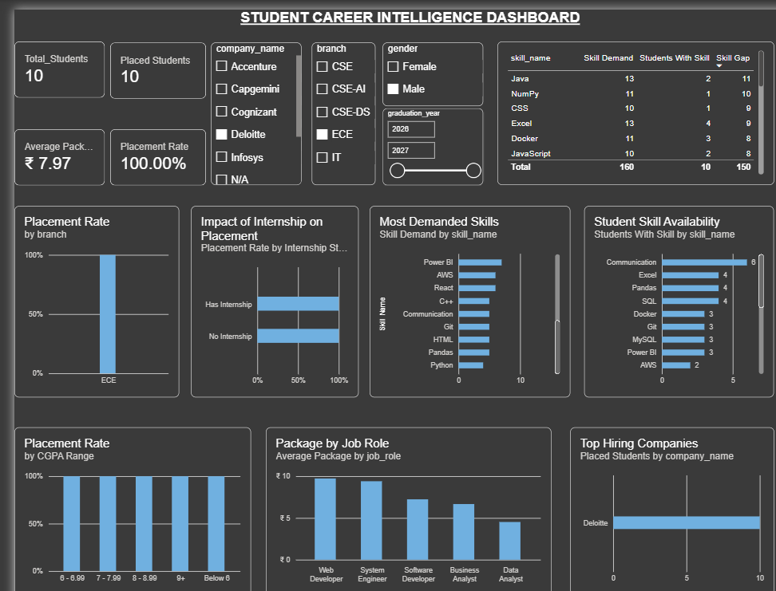
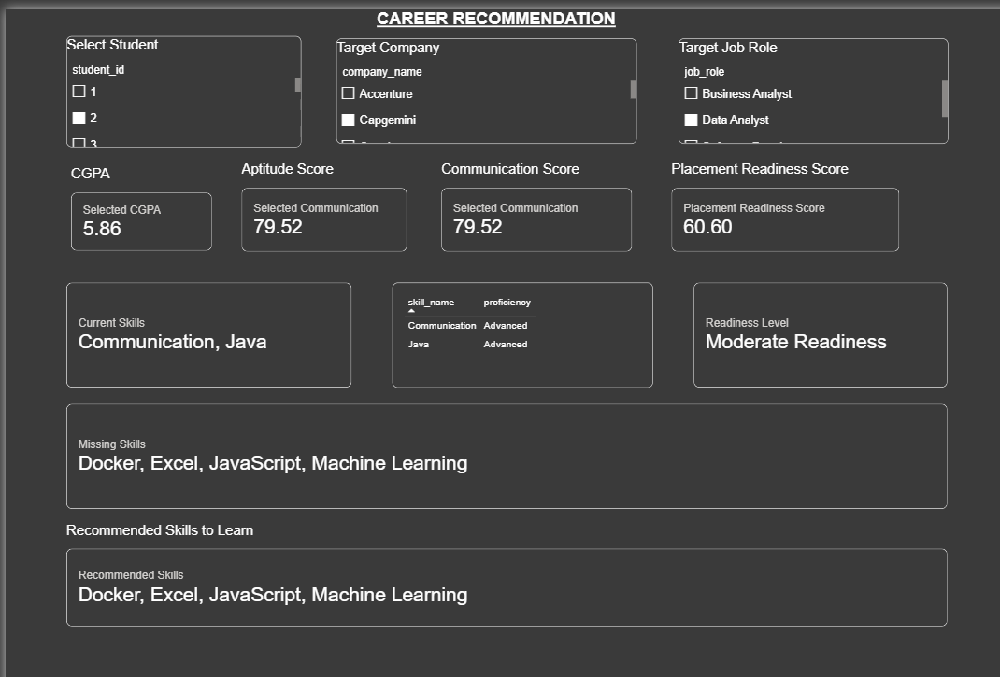

# Student Career Intelligence Dashboard

A data analytics and career recommendation project that analyzes
student placement performance, skills, internships, projects and
company requirements using Python, MySQL, SQL and Power BI.

## Project Overview

The Student Career Intelligence Dashboard helps analyze:

- Student placement performance
- Placement rate by branch
- Placement rate by CGPA
- Internship impact on placement
- Company hiring trends
- Average package by job role
- Company skill requirements
- Student skill availability
- Individual student skill gaps
- Career recommendations
- Placement readiness

## Technology Stack

- Python
- Pandas
- NumPy
- MySQL
- SQL
- Power BI

## Project Architecture

Python
↓
Data Cleaning & Generation
↓
MySQL Database
↓
SQL Analysis
↓
Power BI
↓
Overview Dashboard
+
Career Recommendation Dashboard

## Dashboard Features

### Overview Dashboard

The overview dashboard provides:

- Total students
- Placed students
- Placement rate
- Average package
- Placement rate by branch
- Placement rate by CGPA
- Internship impact
- Most demanded skills
- Student skill availability
- Top hiring companies
- Average package by job role

### Career Recommendation

The career recommendation page allows a user to select:

- Student
- Target company
- Target job role

The dashboard then displays:

- CGPA
- Aptitude score
- Communication score
- Current skills
- Skill proficiency
- Placement readiness score
- Readiness level
- Missing skills
- Recommended skills to learn

## Key Feature

The project compares an individual student's skills
with the skills required by a selected company and job role.

Student Skills
↓
Company Requirements
↓
Skill Matching
↓
Missing Skills
↓
Recommended Skills

## Dashboard Preview

### Overview Dashboard



### Career Recommendation



## Project Structure

```text
student-career-intelligence-dashboard/

├── python/
│   └── data_generation_and_cleaning.ipynb
│
├── sql/
│   ├── database_schema.sql
│   └── analysis_queries.sql
│
├── powerbi/
│   └── Student_Career_Intelligence.pbix
│
├── screenshots/
│   ├── overview-dashboard.png
│   └── career-recommendation.png
│
├── README.md
└── requirements.txt
